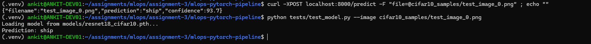
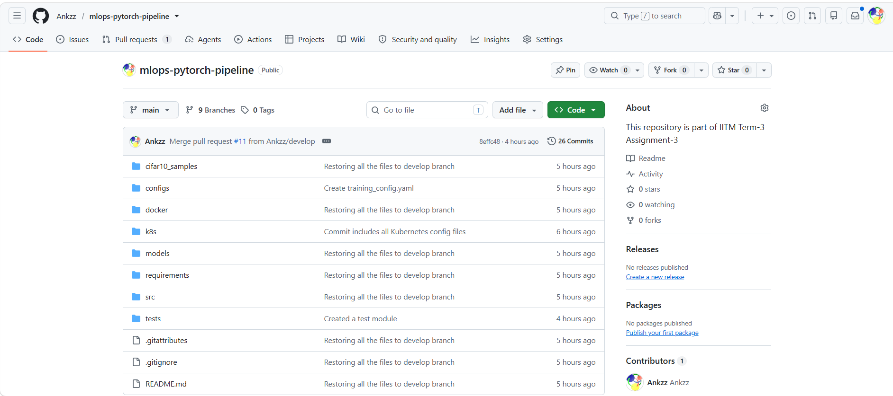
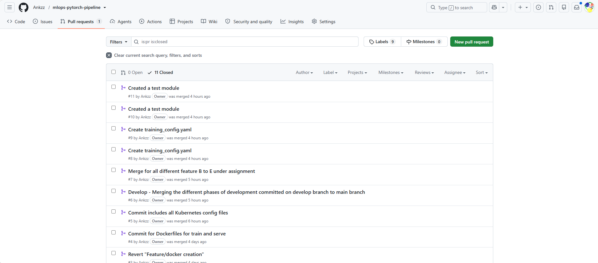
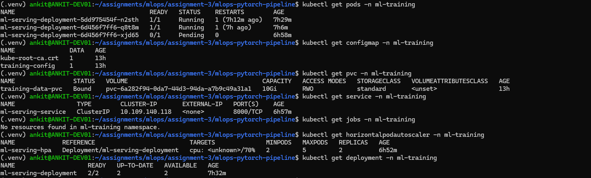

# mlops-pytorch-pipeline
This repository is part of IITM Term-3 Assignment-3

## Overview
In this assignment, a PyTorch image classification model is taken through the full deployment lifecycle: from
local development with proper Git workflows, to containerized training with Docker, to orchestrated deployment on
Kubernetes. By the end, it has a production-style ML pipeline that can train and serve predictions at scale.

## Learning Objectives

By completing this assignment, you will be able to:
    1 Structure an ML project repository with proper Git practices (branching, PRs, .gitignore, secrets management)
    2 Write multi-stage Dockerfiles optimized for ML workloads
    3 Deploy PyTorch training jobs on Kubernetes using Jobs and persistent storage
    4 Serve a trained model via a Kubernetes Deployment with health checks
    5 Use ConfigMaps and Secrets for environment-specific configuration

## Prerequisites
    ● Python 3.10+, PyTorch experience
    ● Docker Desktop installed (or access to a Docker-enabled VM)
    ● kubectl CLI installed
    ● A Kubernetes cluster (Minikube, kind, or a cloud-managed cluster)
    ● A GitHub account

## Architecture
* **Training:** A Kubernetes `Job` that reads hyperparameters from a `ConfigMap` and outputs model checkpoints to a Persistent Volume Claim (PVC). (Supports NVIDIA GPU acceleration).
* **Serving:** A highly available FastAPI application running as a Kubernetes `Deployment`. It mounts the training PVC read-only, loads the latest checkpoint via a `lifespan` manager, and accepts multipart image uploads for inference.
* **Autoscaling:** A Horizontal Pod Autoscaler (HPA) automatically scales the serving pods based on CPU utilization.

graph TD
    Client([Client / curl])

    subgraph Cluster [Kubernetes Cluster]
        subgraph Namespace [Namespace: ml-training]
            
            %% Configuration and Storage
            Config[ConfigMap<br/>training-config]
            PVC[(PVC<br/>training-data-pvc)]

            %% Training Pipeline
            subgraph Training
                Job[Training Job<br/>mlops-train:v1]
            end
            
            %% Serving Pipeline
            subgraph Serving
                HPA[[HPA<br/>Autoscaler]]
                SVC{{Service<br/>ml-serving-service}}
                Deploy[Serving Deployment<br/>FastAPI Replicas]
            end

            %% Internal Connections
            Config -.->|Mounts hyperparameters| Job
            Job ==>|Saves .pth checkpoints| PVC
            PVC -.->|Mounts read-only| Deploy
            HPA -.->|Monitors CPU & scales| Deploy
            SVC ===|Load balances traffic| Deploy
        end
    end

    %% External Connections
    Client ===|POST /predict image| SVC

## Setup

### Prerequisites used:
* [Minikube](https://minikube.sigs.k8s.io/docs/start/)
* `kubectl` CLI configured
* Python 3.10.12 (for local testing)

---

## Setup & Deployment Instructions

### 1. Cluster Preparation
Minikube, start your cluster with enough resources to handle the ML workloads (minimum 2 CPUs and 8GB RAM):
```bash
minikube start --cpus 2 --memory 8192    

# Creates namespace
kubectl apply -f k8s/namespace.yaml
# Creates Configmap
kubectl apply -f k8s/configmap.yaml
# Creates a kubernetes-job for training
kubectl apply -f k8s/training-job.yaml

# Creates the serving deployment
kubectl apply -f k8s/serving-deployment.yaml
# Creates the service
kubectl apply -f k8s/serving-service.yaml
# Creates a horizontal scaler
kubectl apply -f k8s/hpa.yaml

# Get and verify all the pods under ml-training namespace
kubectl get pods -n ml-training
# Get a detailed description of the model-serving pod
kubectl describe deployment model-serving -n ml-training

# Port-forward for local testing
kubectl port-forward svc/model-serving 8000:8000 -n ml-training

# Get health status
curl http://localhost:8000/health

# Send a prediction request
curl -X POST http://localhost:8000/predict -F "file=@test_image.png"

# Example prediction request
curl -X POST http://localhost:8000/predict -F "file=@cifar10_samples/test_image_0.png"

# Validation using the test module
python tests/test_model.py --image cifar10_samples/test_image_0.png

```
## Implementation Details

### Pytorch 
---

Created a src folder under the project-root folder
- `dataset.py`: Lists datasets required for this project
- `model.py` : Returns Resnet18 model
- `train.py`: Methods to help train the model
- `serve.py`: Serves the model through a FastAPI layer wrapped around it.
- `get_test_image.py`: Extract an image from CIFR dataset for testing and stores under `cifar10_samples` folder

### Code organization
---

- Dataset: Data resides under 'data' folder. `dataset.py` picks the same folder and data available under it for extraction, curation, and validation
- Training: `train.py` is used to train the model. Model used here is served through `model.py` which uses resnet18 as the base model
- Serving :  `serve.py` is used to serve out a FastAPI based web application which serves out `predict` API.
  - `serve.py` exposes two apis `/predict` and `/health`.
    - `/predict`: API which takes in the image file as a multi-part file over HTTP request and in response provides a json-response with prediction as one of the parameters.
        - Sample response screenshot


    - `/health`: API which allows the health status of the deployed instance to be presented.
        - Sample response screenshot


### Code Structure on Git
---
Screenshot of the Git-Repo:



### Code commit managed through Pull-Requests
---
All code commits managed through Pull-Requests. Screenshot for the same.




### Kubernetes deployment
---
Screenshot of the Kubernetes deployed:
- Configmap
- PVC
- Service
- Deployment



### How to execute and validate
---

#### API approach:

```sh
(.venv) ankit@ANKIT-DEV01:~/assignments/mlops/assignment-3/mlops-pytorch-pipeline$ curl -XPOST localhost:8000/predict -F "file=@cifar10_samples/test_image_0.png" ; echo ""
{"filename":"test_image_0.png","prediction":"ship","confidence":93.7}
```

#### Test Module approach:

```sh
(.venv) ankit@ANKIT-DEV01:~/assignments/mlops/assignment-3/mlops-pytorch-pipeline$ python tests/test_model.py --image cifar10_samples/test_image_0.png
Loading model from models/resnet18_cifar10.pth...
Prediction: ship
```

## Conclusion

This project successfully demonstrates the end-to-end operationalization of a machine learning model, bridging the gap between local data science development and production-grade software engineering. By containerizing a PyTorch ResNet18 model and deploying it on Kubernetes, we transitioned a static ML script into a highly available, scalable, and resilient web API.

Key achievements of this architecture include:

**Separation of Concerns**: Utilizing Kubernetes ConfigMaps decoupled the hyperparameter configurations from the application code, allowing data scientists to iterate on model tuning without altering the underlying infrastructure.

**Persistent State Management**: Leveraging a Persistent Volume Claim (PVC) created a seamless handoff between the asynchronous training Job and the real-time serving Deployment, ensuring models are safely stored and dynamically loaded.

**Resilient Model Serving**: Implementing FastAPI's lifespan architecture alongside carefully tuned Kubernetes Liveness and Readiness probes solved the notorious "cold start" problem, preventing the cluster from killing pods during heavy model initialization.

**Dynamic Scalability**: Integrating a Horizontal Pod Autoscaler (HPA) ensures the serving infrastructure can automatically adapt to traffic spikes while conserving cluster resources during idle periods.

Ultimately, this project highlights that deploying machine learning is rarely just a data science problem—it is a systems engineering challenge. The resulting MLOps pipeline provides a robust foundation that can be easily adapted for more complex datasets, larger transformer models, or cloud-native production environments.
